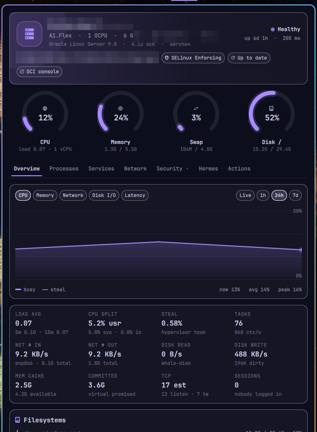

# OmaVM

An Omarchy bar widget and panel that keeps an eye on an Oracle Cloud (OCI) VM
over SSH: live gauges, history charts, processes, services, network, security,
package updates and the Always Free reclaim guard. Colors follow your Omarchy theme.



Nothing is installed on the VM. A small Python collector is streamed over one
multiplexed SSH connection and prints JSON; the panel does the rest locally.

## Install

```bash
omarchy plugin add https://github.com/AbdulazizAlwabel/omarchy-omavm --enable --yes
```

Then point it at your VM (or use the widget's settings in the bar editor):

```bash
omarchy bar set omavm host 203.0.113.10          # public IP or hostname
omarchy bar set omavm user opc                   # default: opc
omarchy bar set omavm keyPath ~/.ssh/oci_key     # empty = your ssh agent / default keys
```

Other settings: `port`, `label` (display name), `barStyle`, `pollSeconds`,
`slowMinutes`, `cpuAlert`, `memAlert`, `diskAlert`, `notify`.

### Requirements

- Key-based SSH to the VM (the first connection accepts and remembers the host key).
- `python3` on the VM. Built and tested on Oracle Linux 9 (RHEL family); on
  other distros the dnf-based update checks simply stay empty.
- Optional, for the privileged views and actions: passwordless `sudo` on the VM
  for `dnf` (update checks), `journalctl`, `systemctl restart` and reboot. Those
  commands run **on the VM only**, never on your machine.
- Optional: Tailscale and firewalld are shown when present.

## What you get

| Tier | Cadence | What |
|---|---|---|
| fast | 3 s while the panel is open, 10 s closed | CPU (incl. steal and iowait), memory, swap, disks, network, disk I/O, per-process CPU, key services |
| slow | 5 min | OCI metadata, OS, listening sockets, firewalld, Tailscale, sshd attacks, journal errors, time sync, sshd config |
| pkg | 60 min | dnf updates, security advisories, reboot-required |

Tabs: **Overview** (alerts, live/1h/24h/7d charts, stats, filesystems, reclaim
guard) · **Processes** · **Services** (logs, restart with confirmation) ·
**Network** · **Security** · **Hermes** (only if [Hermes Agent](https://github.com/NousResearch/hermes-agent) runs on the VM) · **Actions**.

**Always Free reclaim guard.** Oracle may reclaim an idle Always Free VM when its
7-day 95th-percentile CPU, network and memory use are all under 20%. The guard
shows where you stand from the recorded history.

**Hermes Agent is monitor-only.** If it's running on the VM, the plugin shows its
processes and unit state but never signals, restarts, edits or updates it:
restarts of anything named `hermes` are refused in both the panel and `vmctl.sh`.

### Bar pill and keys

Left click opens the panel, middle click refreshes, right click opens an SSH
shell. The pill turns urgent-colored on alerts and dims while the VM is unreachable.

In the panel: `1`–`7` / `←` `→` tabs · `r` refresh · `s` shell · `t` top ·
`c` copy IP · `m` metric · `g` range · `p` process sort · `o` OCI console.

IPC: `omarchy-shell omavm open|close|toggle|refresh|shell|status|tab <name>`

## Privacy and safety

- The only network traffic is your own SSH connection to your VM.
- History stays local, one file per VM:
  `~/.local/state/omarchy/settings/omavm-history-<host>.json`
  (1-minute buckets, 7 days, saved every minute; the previous version is kept
  as `.bak` each session). History recorded by the plugin under its earlier
  name (`oracle-vm-history*.json`) is imported automatically the first time.
- The SSH control socket lives in `~/.cache/omavm/` (mode 700).
- Host, user, port and unit names are validated before they reach `ssh`.
- Local files (history and its backup, SSH error output) are only ever written
  to fresh `mktemp` files and renamed into place, never through a symlink, one
  write at a time. Everything read into the shell (history files, the VM's
  collector output, command errors) is size-capped first.
- Service restarts and reboots ask for confirmation first. Package upgrades
  open in a visible terminal, where `dnf` asks before changing anything.
- With two or more monitors, one instance does the background polling and
  alerts; the pills on every bar show the same live data.

## Uninstall

```bash
omarchy plugin remove omavm --yes
rm -f ~/.local/state/omarchy/settings/omavm-history*   # optional: recorded history
rm -rf ~/.cache/omavm                                  # optional: SSH control socket
```

## Files

```
manifest.json   bar widget declaration and settings schema
BarWidget.qml   the pill
Panel.qml       polling, alerts, history and the panel UI
Leader.qml      picks one instance to poll when there are several bars
Model.js        parsing, formatting, charts, reclaim guard
collector.py    streamed to the VM over SSH; read-only, prints JSON
vmctl.sh        the only thing that talks to the VM
```

## License

MIT — see [LICENSE](LICENSE).
